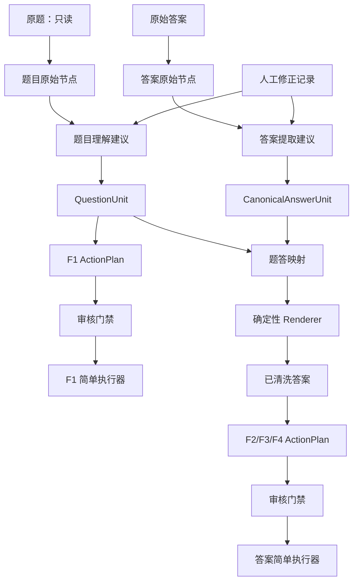

# 墨痕教育智能分层与模块隔离执行规格

> 日期：2026-08-20
> 状态：待按章节逐部分确认和实施
> 文档性质：施工总图，不代表全部功能已经实现
> 阅读对象：业务负责人、开发者、后续接手 Agent
> 核心要求：一次只实施一个部分；每部分必须能够独立测试、独立回退，不得一次性替换整条生产链

## 0. 这份文档怎样使用

这不是一份要求一次做完的“大重构计划”。它把系统拆成十个可单独施工的部分。每次只选择一个部分，完成以下闭环后才能进入下一部分：

```text
读本部分目标
→ 确认输入和输出交接单
→ 只修改本部分
→ 使用假的上游和假的下游独立测试
→ 再与相邻部分做一次联调
→ 保持旧生产入口可用
→ 用户确认后再进入下一部分
```

每个部分都固定回答八个问题：

1. 这一部分负责什么；
2. 原来是怎样的；
3. 现在实际是怎样的；
4. 当前问题是什么；
5. 应该改成什么；
6. 与前后部分如何交接；
7. 本部分坏了怎样隔离和回退；
8. 怎样独立测试，测试证明什么、不证明什么。

### 0.1 本文中的白话词语

| 文中词语 | 白话解释 |
|---|---|
| 上游 | 把材料交给本部分的前一步 |
| 下游 | 接收本部分结果的后一步 |
| 交接单 | 两个部分之间唯一允许传递的数据格式 |
| 编译 | 把“理解结果”转成明确、可检查的动作清单 |
| 执行器 | 不再理解业务，只按动作清单操作 WPS 的代码 |
| 影子模式 | 生成新结果用于比较，但不触发真实 F1/F2/F3/F4 |
| 黄金样本 | 已由人工确认正确、用于以后回归测试的输入和标准结果 |
| 阻断 | 发现不确定或冲突后停止，不继续真实录入 |

## 1. 系统总览：结构没有推倒重来

### 1.1 用户看到的三段业务流程

```text
第一段：原题 → 判断哪些内容属于一道题 → F1 录入

第二段：原始答案 → 找出答案和解析 → 生成已清洗答案

第三段：已清洗答案 → 决定 F2/F4/F3 → WPS 录入
```

`shared_core` 是三段流程共用的规则工具箱，不是第四条业务流程。

### 1.2 目标内部流水线



### 1.3 整体问题

方向已经清楚，但当前若干步骤仍然交叉承担职责：

- 理解层生成了题块，执行层仍会重新判断题块边界；
- 清洗层决定了答案结构，答案执行层仍会重新判断 F2/F4；
- 当前对象能表达连续范围，但难以表达“保留前后内容、排除中间标题”的非连续范围；
- 人工修正尚未形成可重放的数据，下一批仍可能重复修正；
- AI 参与度曾用百分比描述，但百分比不能直接说明权限和风险。

### 1.4 总体解决原则

```text
理解层可以聪明
交接单必须明确
审核层必须可解释
执行层必须简单
任何不确定默认停止
```

## 2. 全局隔离规则：所有部分共同遵守

### 2.1 单向依赖

依赖只能从上游流向下游：

```text
原始节点
→ 语义对象
→ 动作计划
→ 审核决定
→ WPS执行
```

禁止以下反向依赖：

- 题目理解模块导入 WPS 或 `pyautogui`；
- Renderer 调用 F2/F3/F4；
- 执行器重新调用题目或答案解析器；
- 下游修改上游生成的 JSON；
- AI 直接生成 WPS Range 或触发快捷键。

### 2.2 只通过交接单通信

模块之间不得共享可变全局变量，也不得依赖另一个模块运行时留下的内存状态。交接只能使用：

- 有版本号的 Python 数据对象；
- 与该对象一一对应的 JSON；
- 原文件 SHA256；
- 明确的来源引用和生成器版本。

Markdown 只供人看，不得作为机器输入。

### 2.3 写入范围

- 原题永远只读；
- 原始答案不覆盖，只生成派生清洗版；
- 预检、计划、审核和对照报告写到业务源文件之外；
- 测试只写入 `tmp_path` 或系统临时目录；
- 每次测试结束清理临时 DOCX、JSON、PDF、PNG 和审核状态。

### 2.4 失败传播规则

上游失败时，下游不得运行；下游失败时，不得回写上游结果。

| 失败位置 | 必须发生什么 | 禁止发生什么 |
|---|---|---|
| 原始节点读取失败 | 停止当前文件 | 用缺失节点继续猜测 |
| 语义编译失败 | 不生成可执行计划 | 跳过坏题后生成“部分成功”计划 |
| 审核未通过 | 保持 `execution_enabled=false` | 人工未确认就执行 |
| WPS某一动作失败 | 立即停止整批 | 继续 F3 或下一题 |
| AI不可用 | 已知旧链可继续；新结构停止 | 用空结果或旧缓存冒充本次判断 |

### 2.5 每部分的开关

新链路必须有独立开关，默认关闭：

```text
question_contract_v2 = off | shadow | enabled
f1_plan_executor = off | shadow | enabled
answer_contract_v2 = off | shadow | enabled
answer_plan_executor = off | shadow | enabled
ai_proposal_mode = off | shadow | assist | calibrated
```

关闭某一开关时，只退回该部分的旧实现，不强迫其他部分同时回退。

## 3. 第一部分：统一交接单和稳定身份

### 3.1 负责什么

为题目、答案和动作建立不会因同题号、目录移动或不同解析方式而混淆的身份，并规定每个结果怎样指回原文。

### 3.2 原来是怎样的

早期主要依靠题号和段落范围传递信息。不同模块会各自重新扫描文档，再按题号或顺序尝试对齐。

### 3.3 现在实际是怎样的

已有 `QuestionUnit`、`AnswerUnit`、`source_span`、文件 SHA256 和审核状态，但：

- `question_id` 仍可能只是原题号；
- `source_span` 主要表示一个连续范围；
- 题号重置时需要项目特例或按出现顺序映射；
- 规则版本、人工裁决和来源证据没有统一字段。

### 3.4 当前问题

如果两篇材料都出现第1题，单独使用“1”不能区分它们。如果题块中间需要排除一个标题，单一首尾范围也无法完整表达。

### 3.5 目标方案

定义共享契约版本2。最小字段如下：

```text
SourceRef
- document_sha256
- native_kind: paragraph | table | media | formula
- native_id
- occurrence
- text_anchor

StableUnitId
- document_sha256
- unit_kind
- occurrence
- original_label

DecisionEvidence
- rule_id
- reason
- source_refs
- confidence
- generator_version
```

`QuestionUnitV2` 和 `CanonicalAnswerUnit` 不再只保存一个连续区间，而是保存：

```text
included_refs
excluded_refs
unknown_refs
```

每个源节点必须落入三者之一，不能沉默丢失。

### 3.6 前后交接

- 上游：只读原始节点提取器；
- 本部分输出：契约对象及 JSON Schema；
- 下游：题目理解、答案提取、动作编译全部只依赖该契约；
- 本部分不得依赖 WPS 执行器。

### 3.7 隔离和回退

- 新旧契约同时生成，`question_contract_v2=shadow` 时只做差异报告；
- 旧生产链继续消费旧对象；
- 新对象生成失败只影响影子报告，不影响旧链；
- 不原地修改旧 JSON，使用新 schema 版本和新文件名。

### 3.8 独立测试

使用手工构造的原始节点，不打开 WPS：

- 两篇材料各有第1题，稳定ID必须不同；
- 一个题块中间排除标题，序列化再读取后引用不变；
- 表格、图片、公式引用不能被当作普通段落；
- 同一输入重复生成，稳定视图字节一致；
- 未分类节点必须阻断。

证明：交接单能无歧义表达来源和身份。

不证明：题块判断本身正确，也不证明 WPS 能定位这些引用。

## 4. 第二部分：题目理解与 `QuestionUnitV2`

### 4.1 负责什么

阅读整份原题，判断材料、题干、选项、小问、表格、图片和题内标题分别属于哪个题块。

### 4.2 原来是怎样的

主要依靠学科配置、正则、项目白名单和 WPS 扫描现场判断题块边界。

### 4.3 现在实际是怎样的

已有三大核心、`subject_overlay`、题内角色证据、`QuestionUnit`、DocumentProfile 和文档族建议，但角色证据尚未统一接管生产题块，低置信度在现有F1主链中也不总是强制阻断。

### 4.4 当前问题

- 识别“这是一行标题”不等于知道它该从哪一个题块中排除；
- 材料可能只属于首题，也可能属于整组题；
- 图片与题目关系不能只靠文字邻近；
- AI或规则即使给出合理题块，也必须能精确指出来源节点。

### 4.5 目标方案

题目理解分成两个内部步骤：

```text
候选判断器：规则和可选AI分别提出建议
→ 确定性编译器：检查覆盖、顺序、冲突和证据
→ QuestionUnitV2
```

AI只能提交候选关系：

```text
某材料属于哪些题
某标题是题内结构还是顶层边界
某媒体是题图还是装饰图
建议合并哪些连续题号
证据和不确定点
```

确定性编译器负责：

- 所有来源引用存在；
- 题块之间不得非法重叠；
- 题号顺序和项目允许的重置规则一致；
- 表格、图片、公式不能无归属消失；
- 冲突和未知节点进入审核，不生成可执行计划。

### 4.6 前后交接

- 上游：版本化 SourceRef；
- 输出：只读 `QuestionUnitV2.json`；
- 下游：F1动作编译、题答映射；
- 禁止直接调用 WPS、Renderer 或答案录入。

### 4.7 隔离和回退

- 先对真实文件同时运行旧题块和新题块；
- 只比较题块数不够，必须比较每个 `included_ref`、`excluded_ref` 和媒体归属；
- 新结果不一致时旧生产链继续使用，差异进入人工裁决；
- 只有当前文档族通过后才允许该族启用新结果。

### 4.8 独立测试

使用假的 SourceRef 列表和固定候选建议：

- 普通连续题；
- 前置材料只随首题；
- 完整阅读组多题合并；
- 中间标题排除但前后正文保留；
- 标题与原生表格共存时阻断；
- 装饰媒体与题图区分；
- 重复题号和题号重置。

证明：候选建议能够被安全编译成题块或被阻断。

不证明：AI能正确理解所有新文档，也不证明WPS真实选区正确。

## 5. 第三部分：F1动作计划

### 5.1 负责什么

把审核后的 `QuestionUnitV2` 转成逐题F1动作清单，不执行按键。

### 5.2 原来是怎样的

题块判断和WPS执行紧密连接，很多边界只有运行时才最终确定。

### 5.3 现在实际是怎样的

已有 `ActionPlan.json` 预演能力，包含题号、范围、媒体和表格信息，并固定 `preview_only`、`execution_enabled=false`；现有生产F1尚未完全以该计划为唯一输入。

### 5.4 当前问题

如果计划阶段和执行阶段各自判断一次，就可能审核计划A、执行选区B。DOCX段落坐标也不能直接当作WPS坐标。

### 5.5 目标方案

定义 `F1ActionPlanV2`：

```text
plan_id
source_sha256
question_contract_version
generator_version
actions[]
  - action_id
  - stable_unit_id
  - included_refs
  - excluded_refs
  - first_text_anchor
  - last_text_anchor
  - expected_table_count
  - expected_media_count
  - review_status
wps_bindings[]
execution_enabled
blocking_issues[]
```

先生成来源动作，再在Windows当前WPS文档中一次性生成全部 `wps_bindings`。任一动作出现零匹配、多匹配、顺序异常或表格数量不符，整批保持不可执行。

### 5.6 前后交接

- 上游：`QuestionUnitV2`；
- 输出：不可变的 `F1ActionPlanV2.json`；
- 下游：审核门禁和F1执行器；
- WPS绑定器只能补充 `wps_bindings`，不得改变题块语义。

### 5.7 隔离和回退

- `f1_plan_executor=shadow` 时只在WPS中定位并记录选区，不按F1；
- 绑定失败不会修改原计划，输出单独失败报告；
- 当前旧F1入口保留，逐文档族灰度；
- 计划schema升级不覆盖旧计划。

### 5.8 独立测试

无需WPS的测试：

- 固定题块应得到固定动作顺序；
- 每个题块恰好一个F1动作；
- 引用缺失、非法重叠、数量不符时整批失败；
- ActionPlan不得导入 `pyautogui` 或执行模块。

Windows只读绑定测试：

- 逐动作生成唯一Range；
- 选中文本、表格和媒体计数与计划一致；
- `keypress_count=0`。

证明：计划可生成并可绑定WPS选区。

不证明：F1插件已经接受并正确保存题目。

## 6. 第四部分：F1简单执行器

### 6.1 负责什么

严格按照已审核、已绑定的F1动作计划选择Range并按F1。

### 6.2 原来是怎样的

执行时继续扫描障碍物、截断边界、决定是否建立临时副本。

### 6.3 现在实际是怎样的

执行前已经能够得到 `QuestionUnit`，但生产循环仍可能根据当前WPS段落重新调整最终选区，并对低置信度题采用提醒或后台标记。

### 6.4 当前问题

执行器仍有业务判断，就无法保证“测试的是计划、执行的也是同一计划”。某一题失败后若继续下一题，还可能造成后续整体错位。

### 6.5 目标方案

F1执行器只允许五种动作：

```text
读取已审核计划
校验源文档和WPS绑定仍有效
选择指定Range
按一次F1并等待
记录成功或失败后停止/继续
```

禁止重新识别题号、标题、材料、图片归属或截断边界。第一处失败立即停止整批，输出最后成功的 `action_id` 和失败原因。

### 6.6 前后交接

- 上游：审核通过且 `execution_enabled=true` 的计划；
- 输出：只追加 `ExecutionReceipt`，不改原计划；
- 下游：人工或机器可读的录入后核对；
- 执行器不得导入题目解析模块。

### 6.7 隔离和回退

- 新执行器关闭时继续使用旧入口；
- 每批执行前复制计划到本次运行目录；
- 执行失败只影响当前批次，不修改规则和题块；
- 不提供自动重试按键，避免重复录入；恢复必须由人工确认起点。

### 6.8 独立测试

使用 `FakeWpsPort`：

- 记录选区和按键，不连接WPS；
- 第N个动作注入失败，验证N之后按键数为零；
- 源哈希不符、活动文档不符、Range变化全部阻断；
- 执行器输入相同计划时调用序列完全一致。

证明：执行器只照单执行且失败即停。

不证明：真实WPS插件行为与Fake完全一致；后者必须单独Windows验收。

## 7. 第五部分：答案提取与 `CanonicalAnswerUnit`

### 7.1 负责什么

从原始答案文档中找出题号、答案、解析、得分点和来源位置，不决定最终按F2还是F4。

### 7.2 原来是怎样的

每个模板同时负责识别原始格式、清除题干、决定小问结构并生成最终排版。

### 7.3 现在实际是怎样的

已有 `AnswerUnit`、表格答案与正文答案合并、多个专项清洗器、富文本旁路和审核标记；但不同模板仍可能同时承担提取、映射和渲染职责。

### 7.4 当前问题

- 原始答案格式与最终F2/F4策略耦合；
- 纯文本对象无法完整表达公式、图片和富文本来源；
- 规范化后段落坐标不能冒充原始WPS坐标；
- 题号重置可能造成覆盖或顺序兜底。

### 7.5 目标方案

Extractor只输出 `CanonicalAnswerUnit`：

```text
stable_answer_id
original_question_label
occurrence
answer_items[]
analysis_items[]
source_refs
rich_content_refs
extraction_evidence
confidence
review_flags
```

Extractor不允许决定F2/F4，不允许直接写最终清洗DOCX。AI可在这一层提出纯文本答案、解析及来源建议；公式、表格、图片和低置信度内容初期必须退出自动处理。

### 7.6 前后交接

- 上游：原始答案节点和SourceRef；
- 输出：`CanonicalAnswerUnit.json`；
- 下游：题答映射；
- 禁止调用Renderer和WPS答案执行器。

### 7.7 隔离和回退

- 每个现有模板先增加“只输出Canonical数据”的影子入口；
- 原模板继续生成当前清洗文档；
- 新Extractor失败不影响旧模板输出；
- 富文本文件默认走旧专项路径，不尝试统一改写。

### 7.8 独立测试

使用固定段落、表格和对象描述：

- 答案与解析同段、跨段和顺序颠倒；
- `①②`列点不拆小问；
- `(1)(2)`只作为原始答案项记录，不决定F4；
- 表格答案只补正文缺失项；
- 重复题号保留出现序号；
- 公式、图片、未知对象进入 `rich_content_refs` 或阻断。

证明：原始答案能被无损描述或安全拒绝。

不证明：题答对应正确，也不证明最终DOCX排版正确。

## 8. 第六部分：题答映射与确定性Renderer

### 8.1 负责什么

将 `CanonicalAnswerUnit` 绑定到正确的 `QuestionUnitV2`，再按已确认策略生成标准清洗文档。

### 8.2 原来是怎样的

主要按题号精确匹配，找不到时可能按顺序兜底；模板直接决定输出排版。

### 8.3 现在实际是怎样的

已有题目驱动映射、阅读组展开、项目级F2/F4特例、孤立答案和顺序映射审核标记；普通重写链主要以纯文本重建DOCX，富文本模板需要绕开。

### 8.4 当前问题

- 题号正确不代表题目实例正确；
- 顺序兜底可能造成整组错位；
- 相同小问形式在不同项目中可能对应不同插件答案框；
- 通用纯文本Renderer可能删除公式和图片。

### 8.5 目标方案

映射优先级固定：

```text
稳定实例ID完全匹配
→ 已批准的文档族映射规则
→ 人工确认的出现顺序映射
→ 否则阻断
```

未经人工批准的顺序兜底不得自动放行。

Renderer分成两类：

- `PlainTextRenderer`：只处理已证明为纯文本的答案；
- `PreserveRichContentRenderer`：引用原始富文本对象并按专项策略复制，不把对象转成普通文字。

Renderer只根据已确定的 `answer_mode` 排版，不再次推断语义。

### 8.6 前后交接

- 上游：`QuestionUnitV2`、`CanonicalAnswerUnit`和文档族策略快照；
- 输出：映射报告、已清洗DOCX和内容签名；
- 下游：F2/F3/F4动作编译和审核门禁；
- Renderer不得调用快捷键。

### 8.7 隔离和回退

- 新映射只在影子模式输出差异，不覆盖旧清洗版；
- Renderer输出到新的临时文件，验证成功后才替换目标派生文件；
- 富文本能力未完成时明确阻断，不回退成纯文本；
- 某一文件失败不输出整批“全部完成”。

### 8.8 独立测试

映射测试：

- 重复题号、缺一题、多一题、阅读组拆合不同；
- 未批准顺序映射必须阻断；
- 同一答案不能被两个题目消费；
- 所有题目、所有答案和孤立项都有明确状态。

Renderer测试：

- 同一IR重复生成结构一致；
- 纯文本格式、空解析占位、小问顺序正确；
- DOCX ZIP完整、UTF-8正常、无坏关系；
- 富文本样本的图片、公式、表格哈希或关系保持；
- 原答案文件哈希不变。

证明：映射和文档生成各自符合契约。

不证明：WPS插件使用F2/F4后的题库结果正确。

## 9. 第七部分：F2/F3/F4动作计划

### 9.1 负责什么

把审核后的标准答案数据转换成唯一的答案录入动作序列。

### 9.2 原来是怎样的

答案执行脚本读取当前WPS文档后，现场识别题号、小问和解析位置，再决定F2/F4/F3。

### 9.3 现在实际是怎样的

已有 `AnswerUnit`、答案模式、审核门禁和若干项目特例，但执行层仍保留正则判断和旧字典兼容结构。

### 9.4 当前问题

清洗阶段与执行阶段可能对同一个 `(1)(2)` 得出不同结论。某题答案动作失败后，如果继续F3，插件游标会进入未知状态。

### 9.5 目标方案

定义 `AnswerInputActionPlan`：

```text
plan_id
cleaned_answer_sha256
question_contract_version
answer_contract_version
actions[]
  - action_id
  - stable_unit_id
  - action_type: F2 | F3 | F4
  - source_refs
  - item_id
  - expected_text_digest
  - sequence
review_status
execution_enabled
blocking_issues[]
```

动作编译完成后，执行层不得改变F2/F4类型。每道题的动作序列必须事先完整，例如：

```text
普通题：F2 → F3
三小问：F4 → F4 → F4 → F3
空解析：仍保留一次F3跳转动作
```

### 9.6 前后交接

- 上游：已清洗文档、映射结果和内容签名；
- 输出：不可变动作计划；
- 下游：审核门禁和答案执行器；
- 动作编译器不得操作WPS。

### 9.7 隔离和回退

- 先生成新旧动作统计差异：F2、F3、F4数量和逐题顺序；
- 不一致时不执行新计划；
- 旧答案录入入口保留，按项目/文档族灰度；
- 计划生成失败不修改审核状态为通过。

### 9.8 独立测试

- 普通题、整题F2、小问F4、阅读组F4、单翻译小问F4；
- `①②`列点保持F2；
- 每道题恰好一个最终F3；
- 动作序列连续且不可重复消费；
- 修改已清洗DOCX后计划签名立即失效；
- 计划模块不得导入WPS或 `pyautogui`。

证明：审核后的语义能够稳定编译成动作。

不证明：动作在真实插件中全部成功。

## 10. 第八部分：答案简单执行器

### 10.1 负责什么

按照 `AnswerInputActionPlan` 选择指定答案或解析范围，并依次触发F2/F4/F3。

### 10.2 原来是怎样的

执行脚本同时解析文档、判断小问、决定动作并执行快捷键。

### 10.3 现在实际是怎样的

审核门禁已能用文件大小和SHA256阻止清洗后被修改的答案；但执行层仍会重新解析文档并在循环中决定F2/F4。

### 10.4 当前问题

- 计划与实际动作可能不一致；
- 捕获某个异常后仍可能进入后续F3；
- 没有证明插件提供了可靠机器回执；
- 自动重试可能造成重复录入。

### 10.5 目标方案

执行器只允许：

- 读取审核通过的动作计划；
- 再次核对清洗文档SHA256；
- 将计划SourceRef绑定到当前WPS Range；
- 按计划顺序选择和按键；
- 第一处失败停止；
- 记录动作尝试、时间、错误和最后成功位置。

没有插件回读接口时，`ExecutionReceipt` 只能表示“脚本已发出并未观察到异常”，不能表示“题库内容已正确保存”。

### 10.6 前后交接

- 上游：审核通过的答案动作计划；
- 输出：执行记录和人工复核入口；
- 下游：录入后核对；
- 禁止调用答案Extractor、Mapper或Renderer。

### 10.7 隔离和回退

- 新执行器失败不改变已清洗文档和动作计划；
- 当前批次停止后由人工决定恢复点；
- 不自动撤销、不自动重按；
- 旧入口保留到新执行器完成Windows真实验证。

### 10.8 独立测试

Fake执行测试：

- 对固定计划记录精确的Select、F2/F4/F3序列；
- 第N步失败后后续调用为零；
- 活动文档变化、内容签名变化、Range多匹配全部阻断；
- 不产生原答案或清洗答案写入。

Windows验收：

- 先无按键定位；
- 再使用批准的测试副本验证真实按键；
- 分别覆盖F2、F4、空F3和故障中止；
- 人工确认插件实际题库结果。

证明：脚本按计划执行并在可见失败时停止。

不证明：没有回读接口时，脚本记录不能单独证明题库最终内容。

## 11. 第九部分：审核门禁与AI参与等级

### 11.1 负责什么

决定某份语义结果或动作计划是继续、请求人工确认，还是阻断；管理AI在不同文档中的参与方式。

### 11.2 原来是怎样的

主要依靠规则命中、题答数量、置信度和人工检查；AI曾被理解为一个统一百分比。

### 11.3 现在实际是怎样的

已有审核报告、审核状态、内容签名和文档族建议模式；没有高风险项时可以自动批准，但现有审核不能证明所有语义和WPS坐标都正确。

### 11.4 当前问题

- “AI参与70%”没有明确分母；
- AI提取和AI审核可能犯同一种错误；
- 文档族相似不等于F2/F4策略必然相同；
- 陌生文档需要更多AI分析，但应获得更少自动决定权。

### 11.5 目标方案

用权限等级替代单一百分比：

| 等级 | AI可以做什么 | 是否自动进入生产计划 |
|---|---|---|
| L0 | 不参与 | 不适用 |
| L1 | 旁路观察、找异常 | 否 |
| L2 | 提交结构化建议 | 否，人工逐项确认 |
| L3 | 建议通过规则检查后，人工批量确认 | 否 |
| L4 | 已校准文档族的低风险建议可以自动采纳 | 可以，但仍需硬门禁 |
| L5 | 直接生产执行 | 永不开放 |

文档熟悉度与权限关系：

```text
全新结构：AI分析覆盖可以很高，但权限最多L2
相似结构：可进入L2/L3
已校准结构族：满足指标后才可能L4
WPS执行：始终由确定性执行器完成
```

记录以下指标：

```text
proposal_coverage
adoption_rate
automatic_accept_rate
abstention_rate
silent_false_accept_rate
source_anchor_coverage
action_exact_match_rate
human_minutes_per_document
```

AI审核初期只能增加阻断项，不能消除规则阻断或直接批准。

### 11.6 前后交接

- 输入：语义对象、动作计划、规则结果、文档族快照和人工裁决；
- 输出：`approved | needs_review | blocked`及理由；
- 门禁不得修改输入内容；
- 执行器只接受 `approved` 且内容签名一致的计划。

### 11.7 隔离和回退

- `ai_proposal_mode=off` 时全部走确定性旧链；
- `shadow` 时AI结果不影响审核状态；
- 模型或提示词升级后，相关文档族自动退回L2，重新校准；
- AI服务不可用时，已知旧链可以继续，未知结构必须停止。

### 11.8 独立测试

- 人工构造漏题、错组、错坐标、公式丢失和题号错配；
- 验证AI建议不能覆盖硬规则阻断；
- 新文档族不能进入L4；
- 模型版本变化导致既有校准失效；
- 同一输入重复运行产生动作差异时自动降级；
- AI超时、格式错误、部分结果时不产生可执行计划。

证明：权限和阻断规则可执行。

不证明：某个模型达到业务准确率；准确率必须用真实黄金样本另行验证。

## 12. 第十部分：人工修正、文档族快照与复用

### 12.1 负责什么

把人工对题块、答案、映射和动作的修改保存成结构化记录，使下一批能够复用，而不是只留在聊天或手改DOCX中。

### 12.2 原来是怎样的

人工发现问题后修改模板、代码、文档或口头说明；相似问题下一次可能重新排查。

### 12.3 现在实际是怎样的

已有问题归档、回归测试、文档族候选和代表样本，但人工修改本身尚无统一的可重放记录，文档族生产规则快照也未闭环。

### 12.4 当前问题

- 无法区分“系统原判断”和“人工最终判断”；
- 无法知道修改适用于全局、学科、项目、文档族还是单文件；
- 模型或规则升级后，不知道哪些旧裁决需要重放；
- 回退时缺少上一版有效规则快照。

### 12.5 目标方案

定义 `HumanDecisionRecord`：

```text
source_sha256
stable_unit_id
decision_type
system_proposal
human_decision
reason
scope: global | subject | project | family | document
rule_version
model_version
created_at
reviewer
```

每个已校准文档族保存：

- 代表样本；
- 边界样本；
- 允许的能力组合；
- F2/F4策略；
- 当前规则版本；
- 人工裁决摘要；
- 上一版可回退快照。

### 12.6 前后交接

- 输入：影子差异、人工审核和Windows结果；
- 输出：版本化裁决和文档族规则快照；
- 题目理解、答案提取和审核门禁可以读取快照；
- 执行器不得读取人工自由文本来改变动作。

### 12.7 隔离和回退

- 新快照以新版本写入，不覆盖旧版；
- 快照只对声明的作用域生效；
- 未知或冲突作用域不自动提升为全局规则；
- 某个文档族规则有问题时，只回退该族，不回退其他族。

### 12.8 独立测试

- 同一裁决重放得到相同结果；
- 文档级规则不能污染项目级或全局规则；
- 文档族A回退不改变文档族B；
- 规则版本不存在或哈希不符时阻断；
- 模型升级后旧裁决能重新跑差异报告。

证明：人工经验可以被版本化复用和局部回退。

不证明：一条人工裁决天然适合扩大作用域；扩大必须另行审核。

## 13. 模块关联性审查

### 13.1 依赖矩阵

| 模块 | 允许读取 | 唯一输出 | 明确禁止 |
|---|---|---|---|
| 原始节点提取 | 原DOCX/WPS只读对象 | SourceRef集合 | 修改原题、决定F1/F4 |
| 题目理解 | SourceRef、规则快照、可选AI建议 | QuestionUnitV2 | WPS按键、答案排版 |
| F1计划 | QuestionUnitV2 | F1ActionPlanV2 | 重新识别题目语义 |
| F1执行 | 已审核F1计划 | ExecutionReceipt | 修改计划、重新截断边界 |
| 答案Extractor | 答案SourceRef、可选AI建议 | CanonicalAnswerUnit | 决定F2/F4、写最终DOCX |
| Mapper | QuestionUnitV2、CanonicalAnswerUnit | 映射结果 | WPS操作 |
| Renderer | 映射结果、规则快照 | 已清洗DOCX | 重新推断答案语义、按键 |
| 答案计划 | 清洗结果、映射结果 | AnswerInputActionPlan | 重新解析原始答案 |
| 答案执行 | 已审核答案计划 | ExecutionReceipt | 改变F2/F4类型 |
| 审核门禁 | 各阶段事实和证据 | 审核决定 | 修改事实、绕过硬阻断 |

### 13.2 关联审查清单

每一部分提交审查时必须回答：

1. 是否新增了对下游模块的导入？若是，拒绝合并；
2. 是否改变已有交接单？若是，必须升级schema并提供兼容读取；
3. 是否让同一个业务判断在两个模块重复出现？若是，只保留上游一次；
4. 是否在异常时输出了“部分成功”结果？若是，必须改为阻断或明确不完整状态；
5. 是否修改原题、原答案或上游JSON？若是，拒绝；
6. 是否需要同时打开WPS才能测试纯逻辑？若是，说明边界没有拆干净；
7. 是否能关闭本部分的新开关回到旧链？若不能，不允许灰度；
8. 本部分测试失败时是否会触发真实快捷键？任何情况下都必须为否。

### 13.3 自动化边界检查

不额外引入大型框架，先使用现有测试完成以下检查：

- AST或简单导入扫描：纯逻辑模块不能导入WPS/`pyautogui`；
- JSON Schema契约测试：生产者和消费者使用同一版本；
- 黄金JSON回归：相同输入稳定输出；
- 源文件哈希检查：所有只读阶段前后不变；
- 动作计数检查：影子新链与旧链逐动作对照；
- 临时目录检查：测试后无残留业务文件。

## 14. 独立测试和互不影响的具体做法

### 14.1 三层测试

```text
第一层：本部分单元测试
使用假的上游输入和假的下游接口

第二层：相邻两部分契约测试
只验证交接单能否正确交付

第三层：完整业务验收
最后才在Windows/WPS测试真实F1/F2/F3/F4
```

### 14.2 假上游和假下游

| 被测部分 | 假上游 | 假下游 |
|---|---|---|
| 题目理解 | 固定SourceRef JSON | 只记录QuestionUnit，不生成F1 |
| F1计划 | 固定QuestionUnit JSON | 只记录计划，不连接WPS |
| F1执行器 | 固定已审核计划 | FakeWpsPort记录Select/F1 |
| 答案Extractor | 固定答案节点 | 只记录CanonicalAnswerUnit |
| Mapper | 固定题目和答案对象 | 只记录映射，不生成DOCX |
| Renderer | 固定映射JSON | 输出临时DOCX，不按键 |
| 答案计划 | 固定已清洗数据 | 只记录F2/F3/F4序列 |
| 答案执行器 | 固定已审核计划 | FakeWpsPort记录Select/按键 |
| 审核门禁 | 固定事实和故意错误 | 只返回状态，不执行 |

### 14.3 防止测试污染其他部分

- 每个测试创建自己的临时目录；
- 不使用真实工作台目录作为输出；
- 所有外部服务默认禁用，模型测试使用录制的固定响应；
- 所有WPS按键默认替换为Fake；
- 真实WPS测试必须使用专门标记，普通测试命令不得收集；
- 测试不依赖执行顺序；
- 每个测试结束重新核对输入文件哈希；
- 不共用审核状态文件、动作计划文件或运行目录。

### 14.4 测试证据边界

| 证据 | 能证明 | 不能证明 |
|---|---|---|
| 单元测试通过 | 单个模块对构造输入符合契约 | 真实DOCX全部适配 |
| 黄金JSON一致 | 已覆盖样本没有回归 | 新学校新格式一定正确 |
| Mac Quick Look正确 | 开发预览可见、资源大致存在 | Windows WPS分页和选区真值 |
| WPS无按键Range正确 | 能定位预期范围 | 插件成功写入题库 |
| F1/F2/F3/F4按键无异常 | 脚本发出按键且未观察到错误 | 题库内容一定绑定正确 |
| 用户真实录入确认 | 当前批次业务可接受 | 所有文档族已经普遍验证 |

## 15. 分阶段施工顺序

### 阶段A：先打地基，不改变生产行为

1. 第一部分：统一交接单和稳定身份；
2. 建立黄金样本和差异报告；
3. 全部使用影子模式；
4. 旧生产入口不变。

阶段A验收：新交接单能表达重复题号、非连续范围、表格、图片和公式；源文件不变。

### 阶段B：题目录入内部解耦

1. 第二部分：题目理解输出QuestionUnitV2；
2. 第三部分：生成F1动作计划；
3. 先让旧规则消费统一计划；
4. 第四部分：再引入简单执行器；
5. 完成多文档族Windows/WPS灰度。

阶段B验收：审核计划与最终WPS选区是同一份事实；执行层不再改变题块边界。

### 阶段C：答案清洗内部解耦

1. 第五部分：Extractor只提取；
2. 第六部分：Mapper和Renderer分别测试；
3. 优先完成纯文本链；
4. 富文本继续使用专项安全路径。

阶段C验收：同一Canonical答案可独立映射和渲染；公式、图片和表格不会因统一重写而丢失。

### 阶段D：答案执行解耦

1. 第七部分：预先编译F2/F3/F4动作；
2. 第八部分：执行器只照单执行；
3. 注入中途失败，确认后续按键为零；
4. 完成Windows真实插件验收。

阶段D验收：清洗阶段和执行阶段不再重复判断F2/F4；失败不会带偏后续题目。

### 阶段E：逐步释放智能

1. 第九部分：先L1影子观察；
2. 选择纯文本答案提取或题内标题候选做单点实验；
3. 记录人工裁决；
4. 第十部分：形成文档族快照和回放；
5. 达到指标后逐族进入L2、L3；
6. L4只开放给充分校准的低风险建议；
7. 永不开放L5。

阶段E验收：AI能节省人工时间，同时没有增加静默误放行；模型升级可降级和重放。

## 16. 每次只实施一个部分的工作单模板

后续开始任一部分前，先复制以下模板到该部分的实现计划：

```markdown
# 本次施工部分

## 目标
只完成：

## 明确不做

## 当前输入契约

## 当前输出契约

## 允许修改的文件

## 禁止修改的模块

## 假上游

## 假下游

## 单元测试

## 相邻契约测试

## 真实样本验证

## 回退开关

## 证明了什么

## 尚未证明什么

## 归档位置
```

## 17. 总体验收标准

只有以下条件全部成立，才能认为整个目标架构完成：

- 三段业务流程对用户仍然清楚，没有增加第四套平行业务入口；
- 每个语义对象都有稳定身份和可回到原文的来源；
- 题目理解只发生一次，F1执行器不再重新判断；
- 答案结构和F2/F4策略只在计划生成前决定一次；
- 任一WPS动作失败后，后续按键数为零；
- 每个模块可以使用假的上下游独立测试；
- 关闭任一新开关可以局部回退，不要求整条链同时回退；
- 原题哈希始终不变，原始答案不被覆盖；
- 纯文本、表格、图片和公式都有明确处理或明确阻断；
- AI参与等级、模型版本、建议、人工裁决和最终采纳都有记录；
- 未知结构默认阻断；
- Mac、离线、WPS选区和真实插件证据边界分别陈述，不互相冒充。

## 18. 当前建议从哪里开始

第一项施工不是接入AI，也不是重写三个模块，而是：

> 实施“第一部分：统一交接单和稳定身份”，只在影子模式生成新对象和差异报告，不改变任何F1/F2/F3/F4生产行为。

原因是后面所有题目理解、答案映射、动作计划、模块隔离和AI参与，都依赖这张交接单。先把交接单做好，后续每一部分才能真正独立开发、独立测试和局部回退。
