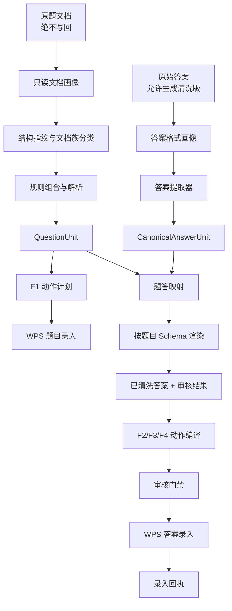

# 墨痕教育架构问题工程思维分析拆解

> 文档性质：架构问题分析与后续工程设计基线  
> 记录日期：2026-07-18  
> 当前状态：第一阶段只读预检 PoC、P0 题内角色证据层、P1a 只读文档族分析与 P1b 页面视觉审核框架已落地；按第一章 6 个根问题统计，1 个已解决、5 个部分解决、0 个未解决

## 核心判断

墨痕教育现在真正遇到的，不是“规则写得不够多”，而是系统缺少三种底层能力：

1. 批量发现一组文档中实际存在多少种结构；
2. 把已有规则拆成可以组合、继承和局部覆盖的能力；
3. 在真实执行 F1、F2、F3、F4 之前，离线验证规则和动作计划。

此前尝试统一“标准答案格式”的方向并没有错，问题在于标准化的层级不对：不应强求所有答案文档具有完全相同的物理排版，而应先把答案统一成同一种逻辑数据，再根据题目的实际结构，渲染成适合 F2、F3、F4 的不同答案文档格式。

整个系统仍然保持三个业务板块：

- 题目录入；
- 答案清洗；
- 答案录入。

共享模型、规则库和动作计划只是三个板块共用的基础设施，不是第四个业务板块。

## 2026-07-18 实施进度

### 计数口径

本文在不同章节用不同角度重复描述了同一批问题。为了避免重复计数，主进度只按第一章的 6 个根问题统计：

- **已解决：1 个**；
- **部分解决：5 个**；
- **未解决：0 个**。

第九章的 14 条“问题与解决方案对照”作为细粒度审计，当前为：**1 条已解决、12 条部分解决、1 条未解决**。部分解决不等于生产完成，只表示已经有可运行基础，但仍缺关键闭环。

因此，“目前解决了几个问题”需要分两种口径回答：

- **严格完成口径：1 / 6**，只有“原题是绝对不可变输入”形成了完整闭环；
- **已进入工程解决口径：6 / 6**，其余 5 个根问题都已有可运行基础，但仍属于部分解决；
- 当前没有仍停留在“完全未着手”状态的根问题。

### 6 个根问题状态

| 根问题 | 当前状态 | 已有证据 | 仍缺什么 |
|--------|----------|----------|----------|
| 1. 原题是绝对不可变输入 | **已解决** | `document_preflight.py` 读取前后核对 SHA256；画像、计划只写源目录之外；3 份真实样本哈希不变 | 后续新增入口仍必须遵守同一硬边界 |
| 2. 系统发现规则错误的时间太晚 | **部分解决** | 可在 WPS 前生成结构画像、动作计划、文档族报告和页面视觉审核；Mac 已可无鼠标预览，Windows WPS 页面真值有独立门禁 | 尚未完成 52 份真实生物批次 WPS 审核，也未成为题目录入主入口的强制门禁 |
| 3. 一个任务并不等于一种格式 | **部分解决** | P1a 已实现候选分族；P1b 已实现人工执行规则族真值、阈值扫描和整批阻断报告 | 尚未取得 52/52 Windows WPS 审核结果，也没有 P1c 文档族规则快照 |
| 4. 规则过度依赖具体文字 | **部分解决** | 结构角色之外，P1b 新增页面区域角色、题图绑定和装饰图排除契约 | 视觉角色尚未完成整批人工确认，也未让生产 F1 解析器消费审核后的角色结果 |
| 5. 共性规则、项目规则和例外规则混在一起 | **部分解决** | 已有三大核心 + `subject_overlay` 项目覆盖层 | 尚未接入 Hydra/OmegaConf，也没有文档族和单文档的有效规则快照 |
| 6. 题目结构识别和真实执行耦合过紧 | **部分解决** | 已能离线编译 F1 预演动作，计划固定 `preview_only` | WPS 执行器尚未消费 ActionPlan，WPS Range 与审核门禁尚未绑定 |

### 第一阶段已经落地的能力

```text
原始 DOCX（只读）
→ 原生 python-docx/OOXML 扫描（坐标真值）
→ Docling 旁路结构对照（可选）
→ DocumentProfile.json（机器事实）
→ ActionPlan.json（F1 预演契约）
→ Markdown（人工审核视图）
```

- JSON 是机器权威事实，Markdown 只由 JSON 单向生成，不作为执行输入；
- 动作计划包含原始段落、虚拟节点、原生表格、媒体和公式位置；
- PoC 固定 `execution_enabled=false`，不会连接或触发 F1/F2/F3/F4；
- pytest-regressions 已固化最小黄金 JSON；
- 真实样本验证覆盖纯文本、原生表格/图片/公式、众美完整阅读题，动作数分别为 1、119、30；
- 实现入口：`shared_core/document_preflight.py`；
- 设计入口：`docs/plans/2026-07-16-document-preflight-poc-design.md`；
- 证据归档：`问题归档/题目录入/2026-07-16-DOCX只读画像与F1预检动作计划PoC.md`。

### 第二阶段 P0 已落地的能力：题内角色证据层

```text
原生段落特征 + 可选 Docling 结构标签
→ 保守加权判定
→ 段落角色 + 置信度 + 可解释证据
→ DocumentProfile.json 1.1
```

- 当前角色包括：文档标题、顶层板块标题、题内小标题、题号起点、选项和正文；
- 题号与选项属于强结构信号，Docling 只作旁证，不能覆盖它们；
- Docling 与原生段落采用单调精确对齐；对齐失败时保留原生判断，不强行猜测；
- `automatic_exclusion_enabled=false`，角色层只输出证据，不改变现有题块与 F1 动作计划；
- 三份真实样本的动作数仍为 1、119、30，源文件 SHA256 均未变化；
- 测试结果为 `33 passed, 602 subtests passed`；
- 实现入口：`shared_core/document_roles.py`；
- 设计入口：`docs/plans/2026-07-16-document-role-evidence-design.md`；
- 证据归档：`问题归档/题目录入/2026-07-16-DOCX题内角色证据层.md`。

### 第二阶段 P1a 已落地的能力：只读文档族分析

```text
多个 DocumentProfile.json 1.1
→ 角色分布、动作/标题/媒体/公式密度与结构存在性
→ 可解释加权相似度
→ 完全链接候选分组
→ 代表样本、异常候选、未决单例和人工复核队列
→ DocumentFamilyReport.json 1.0 + 派生 Markdown
```

- 相似度六个分项权重固定且总和为 1，每一对文档都输出分项分数和加权贡献；
- 分组采用完全链接，合并阈值为 `0.78`，避免 A 像 B、B 像 C 时发生链式误并；
- 批次至少 3 份且单例最高近邻相似度低于 `0.60` 时，才标为异常候选；
- 多成员族代表样本使用 medoid，输入顺序变化不改变报告；
- 固定 `classification_mode=advisory_only`、`automatic_rule_binding_enabled=false`、`production_execution_enabled=false`；
- 现有三份跨项目基线被保守分为 3 个单例异常候选，两两相似度为 `0.292741—0.331961`，没有强行合并；
- 生成前后 3 份 Profile 与 3 份 ActionPlan 内容哈希均未变化，动作数仍为 1、119、30；
- 定向测试 `12 passed`，与预检联合回归 `18 passed`；
- 实现入口：`shared_core/document_families.py`；
- CLI 入口：`tools/analyze_document_families.py`；
- 设计入口：`docs/superpowers/specs/2026-07-16-document-family-analysis-design.md`；
- 证据归档：`问题归档/题目录入/2026-07-16-DOCX文档族分组与异常样本发现P1a.md`。

### 第二阶段 P1b 已落地的能力：跨平台页面视觉预检与校准门禁

```text
Mac Quick Look 连续预览（开发证据，非分页真值）
或 Windows WPS 只读导出 PDF（生产页面真值）
→ pypdfium2 逐页 PNG + pdfplumber 页面区域
→ PageRenderManifest.json
→ VisualRoleReview.json / VisualReviewSummary.json
→ P1bCalibrationReport.json（阈值扫描 + 整批门禁）
```

- Mac 入口通过系统 Quick Look 和 WebKit 无鼠标生成连续预览，固定 `page_truth_authority=false`；
- Windows 入口通过 WPS COM 只读打开并导出 PDF，固定校验源 SHA256，只有该链路可作为生产页面真值；
- 页面区域角色覆盖文档横幅、标题、分值说明、训练标签、题组标题、题目文字、题目图片和未知区域；未知或未确认区域阻断整批校准；
- `pypdfium2` 是跨平台默认 PDF 栅格化器，保留 `pdftoppm` 兼容路径；重复运行会先清理旧页面 PNG，避免陈旧页面混入；
- 未来高二生物作业1的 Mac 真实预览已回读：99 个文字区域、12 个图片区域，章节横幅、对点训练、综合强化及 9 张题图均可见，源哈希未改变；
- 该结果只证明开发预览链路可用，不代表 52 份 Windows WPS 生产校准完成；P1b 仍未达到严格完成口径；
- 全部安全开关继续保持 `automatic_rule_binding_enabled=false`、`production_execution_enabled=false`；
- 实现入口：`shared_core/document_render.py`、`shared_core/macos_quicklook_render.py`、`shared_core/document_visual_review.py`、`shared_core/document_family_calibration.py`；
- CLI 入口：`tools/build_document_render.py`、`tools/build_visual_review.py`、`tools/calibrate_document_families.py`；
- 证据归档：`问题归档/题目录入/2026-07-18-P1b跨平台页面视觉预检与校准门禁.md`。

## 一、问题的准确工程定义

### 1. 原题是绝对不可变输入

原题文档的排版、字号、页边距、表格、图片、标题、段落顺序都不能修改。系统不能采用以下方案：

```text
先把所有原题修改成统一格式
→ 再按统一格式录入
```

只能采用：

```text
只读扫描原题
→ 在原题之外理解结构
→ 生成题块和录入计划
→ 对原题只做选区和按键
```

对应的工程术语：

- **Immutable Input**：不可变输入；
- **Non-destructive Processing**：非破坏式处理；
- **Read-only Adapter**：只读适配器；
- **Sidecar Metadata**：伴随式元数据，把分析结果写在旁边的 JSON 或报告中，不写回原文档。

这应成为最高优先级的非功能要求，而不是一条普通业务规则：原题文件必须零写回，只有答案文档可以产生清洗版等派生产物。

### 2. 系统发现规则错误的时间太晚

目前的工作方式接近：

```text
写一份规则
→ 真实录入一个文档
→ 人工发现录错
→ 修改规则
→ 再录下一个文档
```

这叫 **Reactive Development（反应式开发）**：错误真实发生以后，系统才获得信息。

它造成的问题不只是慢：

- 错误可能直接进入真实题库；
- 每次只能验证一份文档；
- 无法提前知道同一文件夹还有几种结构变体；
- 后面的文档可能推翻前面刚写好的规则；
- 一批二三十份文档只能串行试错。

解决方向是 **Shift-left Validation（验证左移）**：

```text
批量只读扫描全部文档
→ 识别结构族
→ 每个结构族选代表样本
→ 生成或选择规则候选
→ 离线验证整批文档
→ 最后才进入 WPS 真实录入
```

规则验证必须发生在 F1 之前，而不是 F1 之后。

### 3. 一个任务并不等于一种格式

“众美高三语文”不是一种格式，而是一个包含多个结构族的任务集合：

```text
众美高三语文
├── 对点训练
│   ├── 结构族 A
│   ├── 结构族 B
│   └── 少量异常文档
└── 文言文
    ├── 结构族 C
    ├── 结构族 D
    └── 特殊翻译题结构
```

更准确的工程概念是：

- **Document Family**：文档族；
- **Document Archetype**：文档原型；
- **Layout Variant**：排版变体；
- **Outlier Document**：离群文档或异常文档。

系统现在主要依赖项目名、文件名、正文关键词和具体正则，没有先对整批文档进行结构分族，因此人工实际上承担了“文档分类器”的工作。

### 4. 规则过度依赖具体文字

当前规则常常依赖：

```text
高考专练
典题专练
专项训练
基础知识讲解
```

如果下一批改成：

```text
高考实战
经典例题
专项提升
知识点讲解
```

规则就会失效。

对应的工程问题：

- **Brittle Rule**：脆弱规则；
- **Literal Matching**：字面匹配；
- **Overfitting**：过拟合，只适合见过的样本；
- **Exact-match Dependency**：精确匹配依赖。

系统需要识别的不是“这句话是否等于高考专练”，而是“这一段是否承担题内小标题的角色”。具体文字只能作为证据之一，不能成为唯一证据。

### 5. 共性规则、项目规则和例外规则混在一起

规则应继续分层：

```text
全局规则
→ 学科核心规则
→ 项目规则
→ 文档族规则
→ 单文档例外补丁
```

例如：

```text
全局：
- 表格内数字不作为题号
- 原题不可写回

文科：
- 支持材料题
- 支持主观大题小问

语文：
- 支持阅读材料
- 支持文章与所属题目的关系

众美：
- 某些阅读题按整组录入
- 某类题内小标题需要排除

众美文言文族 B：
- 双篇文章允许题号重置

20《苏武传》：
- 原题号 1、2、5、6 映射为 1、2、3、4
```

对应的工程术语：

- **Rule Hierarchy**：规则分层；
- **Rule Inheritance**：规则继承；
- **Rule Composition**：规则组合；
- **Delta Override**：差异覆盖，只写与父规则不同的部分；
- **Open-Closed Principle**：对扩展开放，对修改核心关闭。

每次新任务不应复制一整套规则，而应在已有能力上只描述差异。

### 6. 题目结构识别和真实执行耦合过紧

如果只有真正录完后，人工才能判断题块是否正确，说明以下环节绑定得太紧：

```text
题目解析
F1 选区
真实按键
人工验收
```

工程上叫 **Tight Coupling（紧耦合）**。

题目录入应拆成两个阶段：

```text
阶段一：编译题目计划
原题 → QuestionUnit → F1 动作计划

阶段二：执行计划
F1 动作计划 → WPS 选区和按键
```

录入前可以先生成可读计划：

```text
文档：对点练案12.docx

预计录入：8 个题块

题块 1：
- 类型：完整阅读组
- 覆盖原题：1-3
- 选区：第 5 段到第 34 段
- 排除：第 18 段“（一）高考专练”
- 包含图片：是
- 包含表格：否
- 置信度：0.96

题块 2：
- 类型：普通选择题
- 覆盖原题：4
- 选区：第 35 段到第 40 段
- 置信度：0.99
```

人工审核的是“动作计划”，而不是等待真实录错后再审核。

对应的工程术语：

- **Dry Run**：试运行；
- **Preflight**：执行前预检；
- **Execution Plan**：执行计划；
- **Plan/Execute Separation**：计划与执行分离；
- **Shadow Mode**：影子模式，只生成结果，不真实执行；
- **Compile Then Execute**：先编译，后执行。

## 二、系统怎样自动发现五六种结构

系统不应“看完文档后自己拍脑袋写规则”，而应分为三个可验证步骤。

### 第一步：批量建立文档画像

对一个文件夹中的全部原题执行只读扫描，提取：

- 段落文本；
- Word 样式名；
- 字号、粗体、颜色；
- 段前段后间距；
- 缩进和大纲级别；
- 编号形式；
- 段落长度；
- 是否位于表格中；
- 是否包含图片或公式；
- 上下段的结构；
- 题号和小问的出现方式；
- 重复标题和重复提示语。

读取这些信息不会修改原题。分析结果应写在原题之外，例如：

```text
众美高三语文_文档结构画像.json
众美高三语文_结构分组报告.md
```

对应的工程术语：

- **Document Profiling**：文档画像；
- **Corpus Profiling**：整批语料画像；
- **Feature Extraction**：特征提取；
- **Schema Discovery**：结构发现。

### 第二步：建立结构指纹并自动分组

不能把完整文本直接当指纹，因为每份题目的具体内容都不同。系统需要先做结构归一化：

```text
“第12课 现代文阅读”
→ “第<N>课 <标题>”

“完成1-3题”
→ “完成<N>-<N>题”

“（一）高考专练”
→ “（<中文序号>）<短标题>”
```

再组合以下特征：

- 标题结构；
- 题号结构；
- 小问结构；
- 阅读材料结构；
- 表格和图片位置；
- 题型顺序；
- 段落样式分布。

这些特征共同形成 **Structural Fingerprint（结构指纹）**，系统再按相似度进行分组：

```text
结构族 A：18 份
结构族 B：7 份
结构族 C：3 份
异常文档：2 份
```

对应的工程术语：

- **Structural Fingerprinting**：结构指纹；
- **Document Clustering**：文档聚类；
- **Similarity Scoring**：相似度评分；
- **Outlier Detection**：异常文档检测；
- **Drift Detection**：结构漂移检测。

第一版不建议直接上机器学习，先使用可解释的加权评分：

```text
标题样式相同：+2
题号模式相同：+3
题型顺序相同：+3
小问形式相同：+2
表格位置相同：+2
关键边界模式相同：+3
```

这样系统判断两份文档属于同一族时，可以同时说明判断依据。

### 第三步：只让人工确认代表样本和异常样本

假设 30 份文档被分成 4 个结构族和 2 个异常文档，人工不再逐份试录，而是：

- 每个结构族检查 1 份最有代表性的文档；
- 每个异常文档单独检查；
- 低置信度文档额外检查。

人工审核量可能从 30 份下降到约 6 份。

对应的工程术语：

- **Representative Sampling**：代表样本抽取；
- **Active Learning**：主动学习，优先让人检查最有信息量的样本；
- **Human-in-the-loop**：人在回路中；
- **Abstention**：系统不确定时主动放弃自动判断，而不是强行猜测。

合理的自动化边界是：系统负责发现可能存在多少种结构并提出候选；人工负责确认这些结构在业务上应该怎样录入。

## 三、小标题识别要从文字匹配升级为角色识别

当前方式类似：

```python
ignore_patterns = [
    "高考专练",
    "典题专练",
    "专项训练",
]
```

这是黑名单式规则，需要不断补词。

更合理的方式是综合多个信号判断一段是否为题内小标题：

- 段落很短；
- 独立成段；
- 没有句末标点；
- 使用标题样式、粗体或特殊字号；
- 以“（一）”“一、”“第一部分”等形式开头；
- 下一段是题干、材料或小问；
- 自身不满足正常题号结构；
- 在同批文档中反复出现在相似位置。

可以形成一个组合规格：

```text
is_internal_heading =
    short_text
    AND isolated_paragraph
    AND heading_style_signal
    AND next_block_is_question_content
    AND NOT numbered_question
```

对应的工程术语：

- **Feature-based Classification**：基于特征的分类；
- **Context-aware Parsing**：上下文感知解析；
- **Structural Semantics**：结构语义；
- **Specification Pattern**：规格模式，用多个判断条件组合出一个业务定义。

不能简单改成模糊匹配，因为“只要和高考专练有点像就忽略”可能误删真正题干。正确策略应是：

```text
结构证据为主
关键词为辅
精确词表作为已知快速通道
低置信度时要求人工确认
```

这叫 **Conservative Parsing（保守解析）**。

## 四、题目录入规则应从完整模板变成可组合能力

不应为每种变体复制一份完整规则，而应拆成稳定的基础能力：

```text
识别普通题号
识别小问
识别材料题范围
识别完整阅读组
识别前置材料
识别原生表格
识别图片
识别题内小标题
识别顶层板块边界
支持题号重置
保留特殊题号前缀
```

一个文档族只负责组合能力：

```yaml
family: zhongmei_chinese_reading_v2
base: chinese_reading

capabilities:
  group_reading_questions: true
  preserve_native_tables: true
  allow_question_number_reset: false
  exclude_internal_headings: true

boundary_policy:
  stop_at_next_reading_prompt: true
  stop_at_top_level_section: true
```

另一个文档族只描述差异：

```yaml
family: zhongmei_classical_dual_article
base: zhongmei_classical

overrides:
  allow_question_number_reset: true
  group_translation_subquestions: true
```

对应的工程思想：

- **Configuration over Code**：配置优于代码；
- **Declarative Rules**：声明式规则，描述“是什么”；
- **Strategy Pattern**：策略模式；
- **Capability Composition**：能力组合；
- **Delta Configuration**：差异配置。

## 五、答案清洗为什么会发生规则爆炸

现在的答案清洗模板同时承担两件事情：

1. 理解原始答案文档是怎样排版和表达的；
2. 根据题目的录入方式，把答案改成 F2、F3、F4 能使用的格式。

这两个维度耦合后会出现组合爆炸。假设存在 5 种原始答案排版和 6 种题目结构，如果每个组合写一份完整模板，理论上会产生：

```text
5 × 6 = 30 种模板组合
```

对应的工程术语：

- **Combinatorial Explosion**：组合爆炸；
- **Cartesian Product Problem**：笛卡尔积问题；
- **Orthogonal Concerns Coupling**：两个本应独立的维度被耦合。

## 六、答案清洗应拆成三层

### 第一层：答案提取器 Extractor

提取器只关心原始答案文档是怎样写的：

```text
答案标记是【答案】还是“答：”
解析标记是【解析】还是“解析：”
答案是否连写
答案是否在表格中
答案是否跨行
题号是否独立成段
```

它不关心最终使用 F2 还是 F4，输出统一逻辑数据：

```json
{
  "source_question_id": "9",
  "raw_answer_items": ["……"],
  "raw_analysis_items": ["……"],
  "source_spans": {
    "answer": [20, 21],
    "analysis": [22, 25]
  }
}
```

### 第二层：题答映射器 Mapper

映射器读取题目录入生成的题目结构：

```text
第 9 题是普通题
第 10-12 题是完整阅读组
第 13 题包含 3 个小问
第 14 题虽然有①②③，但只是答案列点
```

再把答案绑定到正确的 `QuestionUnit`。

对应的工程术语：

- **Schema-driven Mapping**：由题目结构驱动的映射；
- **Contract-based Integration**：基于契约的模块协作；
- **Stable Identity Mapping**：稳定身份映射。

### 第三层：答案渲染器 Renderer

渲染器根据题目结构决定已清洗答案应怎样写。

普通题：

```text
9
答案：……
解析：……
```

三个小问：

```text
13
答案：
(1)……
(2)……
(3)……
解析：……
```

完整阅读组：

```text
10-12
答案：
(10)……
(11)……
(12)……
解析：……
```

只有在这一层才决定：

- 使用 F2 还是 F4；
- 解析是否合并；
- 得分点进入答案还是解析；
- 是否补空白解析占位。

标准化的对象应该是逻辑模型，而不是所有答案 DOCX 的视觉排版。统一模型可以命名为 `CanonicalAnswerUnit`，至少包含：

```text
题目稳定 ID
答案模式
答案项
解析项
小问 ID
来源位置
置信度
审核标记
```

对应的工程术语：

- **Canonical Model**：规范化模型；
- **Intermediate Representation（IR）**：中间表示；
- **Schema-driven Rendering**：模式驱动渲染；
- **Separation of Extraction and Presentation**：提取与展示分离。

这样，5 种原始答案格式和 6 种题目结构不再要求 30 份组合规则，而是接近：

```text
5 个提取器 + 6 个渲染策略
```

规则数量从乘法增长变为加法增长。

## 七、答案录入模块应成为简单执行器

答案录入模块不应再次判断：

- ①②是否属于小问；
- 某个标题是否属于解析；
- 阅读组有几个答案；
- 是否应该拆成 F4。

这些语义判断应在答案清洗和审核阶段完成。答案录入只消费已经审核的动作计划：

```json
{
  "question_id": "reading_group_10_12",
  "actions": [
    {"type": "F4", "span": [30, 30], "item_id": "10"},
    {"type": "F4", "span": [31, 31], "item_id": "11"},
    {"type": "F4", "span": [32, 32], "item_id": "12"},
    {"type": "F3", "span": [33, 38], "item_id": "analysis"}
  ]
}
```

对应的工程思想：

- **Action Plan**：动作计划；
- **Command Pattern**：命令模式；
- **Dumb Executor**：简单执行器；
- **Semantic/Execution Separation**：语义判断与执行分离。

发生错误时就能明确定位：

```text
答案提取错
题答映射错
答案渲染错
动作编译错
WPS 选区错
快捷键执行错
```

而不是把所有问题都归为“答案录入错位”。

## 八、推荐的整体架构



这是一种：

- **Modular Monolith**：模块化单体，仍然是一个本地项目，不拆微服务；
- **Pipeline Architecture**：流水线架构；
- **Ports and Adapters**：端口与适配器架构，业务核心不依赖 WPS 细节；
- **Rule-driven System**：规则驱动系统。

当前已落地题目侧的 `Q0 → Q1 → 角色证据 → Q2(P1a建议分族)` 旁路、P1b 页面视觉审核与校准门禁框架，以及既有 `Q4 → Q5` 预演旁路。P1b 还缺 52 份 Windows WPS 生产页面真值和人工确认，`Q2` 尚未向 `Q3` 输出生产规则快照；`Q5` 仍是预演计划。`Q3` 配置化规则组合、`Q6` 受控 WPS 执行，以及答案侧的规范化三层链路都还没有形成完整闭环。

## 九、问题与解决方案对照

| 现象 | 对应解决方案 | 当前状态 | 当前证据与缺口 |
|------|--------------|----------|----------------|
| 原题不能修改 | 只读扫描；画像、规则、计划写到旁路文件 | **已解决** | SHA256 前后校验和 sidecar 已落地；3 份真实原题未改变 |
| 录完一份才知道规则错 | 整批先扫描并生成动作计划，再真实录入 | **部分解决** | 支持批量预检、P1a 分族和 P1b 页面视觉门禁；52 份 Windows WPS 审核尚未完成 |
| 一批文档有五六种结构 | 批量画像、结构指纹、自动分组 | **部分解决** | P1a 有候选族，P1b 有人工真值和阈值扫描；缺真实整批确认与 P1c 规则快照 |
| 小标题换一个字就失效 | 结构特征、上下文、关键词组合识别 | **部分解决** | 已有结构角色和页面视觉角色契约；尚未接入生产 F1 自动排除与整批已确认视觉真值 |
| 每个任务都要重写规则 | 全局→学科→项目→文档族→例外补丁 | **部分解决** | 已有三核和项目 overlay；缺文档族配置与差异快照 |
| 题目录入必须真实运行才验证 | 先生成 QuestionUnit 和 F1 Plan | **部分解决** | F1 ActionPlan 已生成；WPS 尚未消费计划 |
| 标准答案格式无法适配所有题目 | 统一 AnswerUnit，按题目结构分别渲染 | **部分解决** | 已有 `AnswerUnit` 和部分项目映射；缺统一 Renderer 契约 |
| 原始答案格式×题目格式产生大量模板 | Extractor + Mapper + Renderer 正交拆分 | **部分解决** | 已有提取/映射函数基础；专项清洗器仍承担多种职责 |
| 新规则只能用于当前任务 | 将规则拆成材料题、阅读组、标题、表格等能力 | **部分解决** | overlay 已暴露若干能力开关；仍是 Python 配置，组合粒度不足 |
| 系统遇到未知结构仍继续运行 | 新结构或低置信度先阻断并要求确认 | **部分解决** | PoC 固定阻断真实执行；现有 F1 主链尚未统一执行该门禁 |
| 人工修正不能自动复用 | 保存系统判断、人工修改和修改原因 | **未解决** | 尚无结构化人工反馈记录与回放链路 |
| 规则修改容易影响旧任务 | 每个文档族保存代表样本和边界样本 | **部分解决** | 已有 pytest-regressions 黄金 JSON 和 3 份真实基线；尚未覆盖每个文档族 |
| 三模块容易题答错配 | 共享稳定 ID、QuestionUnit、AnswerUnit | **部分解决** | 共享模型已存在；F1/F2/F3/F4 还未统一使用同一动作契约 |
| 无法判断规则为什么命中 | 输出命中证据、评分和规则版本 | **部分解决** | 已有置信度、告警、来源坐标和 Docling 版本；缺规则命中证据与有效规则版本 |

## 十、工程师需要坚持的思维转变

### 1. 从“再加一个正则”转向“这个差异属于哪一层”

遇到新情况先判断：

```text
这是全局规律？
学科规律？
项目规律？
文档族规律？
还是单文件异常？
```

不能每次都直接向公共逻辑增加 `if/else`。

### 2. 从“识别具体文字”转向“识别业务角色”

不是判断：

```text
这句话是不是“高考专练”
```

而是判断：

```text
这一段是不是题内小标题
```

具体文字只是证据之一。

### 3. 从“每份文档验证”转向“每个结构族验证”

系统先分族，人工只确认：

```text
每个结构族的代表样本
+ 所有异常样本
+ 低置信度样本
```

### 4. 从“运行后纠错”转向“执行前编译”

真实 WPS 操作之前必须已经得到：

- 题块清单；
- 题答映射；
- F1、F2、F3、F4 动作计划；
- 风险报告；
- 阻断结果。

WPS 层只负责执行经过审核的计划。

### 5. 从“一个万能模板”转向“可组合的小能力”

不追求一个能够处理所有文档的巨大模板，而是追求：

```text
多个稳定的小能力
+ 文档族配置
+ 少量差异补丁
```

### 6. 从“完全自动”转向“系统只在有把握时自动”

高可靠系统最重要的能力之一，是知道什么时候不能自动决定。这叫 **Fail-safe Defaults** 和 **Abstention**。

墨痕教育合理的自动化目标应是：

```text
已知结构：全自动
相似结构：自动建议
未知结构：批量发现后请求一次确认
不确定结构：绝不直接真实录入
```

## 十一、最终工程定义

墨痕教育需要建设的是：

> 一个面向不可变原题文档的、规则驱动的、可分族学习的、具备人工确认与回归验证能力的文档理解和 WPS 自动录入流水线。

近期最应优先建设的三项底层能力及当前状态：

1. **批量只读文档画像、结构指纹和文档族分组**：**P1a 已完成、P1b 框架已完成、生产闭环部分完成**。画像、建议分组、页面视觉审核契约、人工真值阈值扫描和整批门禁代码已落地；52 份 Windows WPS 人工校准和 P1c 规则快照未完成；
2. **题目录入的“预检—动作计划—真实执行”分离**：**部分完成**。预检和 F1 预演计划已落地，WPS Range、审核门禁和受控执行未完成；
3. **答案清洗的“提取器—题答映射—按题目结构渲染”分离**：**部分完成**。已有 `AnswerUnit`、题答映射和专项清洗基础，但尚未形成统一 `CanonicalAnswerUnit` 与 Renderer 边界。

这三项成立以后，新任务仍可能需要新增规则，但新增内容应从“一整套项目脚本”缩减为：

```text
复用旧文档族
+ 组合已有能力
+ 描述少量差异
+ 为真正异常的文档补一个小补丁
```

## 十二、必须写死的实施边界

1. 原题文档是不可变输入，任何流程都禁止覆盖、保存或写回原题；
2. 原题只允许被读取、建立画像、生成外部元数据，以及在 WPS 中执行选区和按键；
3. 只有答案文档允许生成 `_已清洗.docx` 等派生产物；
4. 所有题目画像、结构指纹、题块清单、动作计划和审核结果都必须存放在原题之外；
5. 低置信度、未知结构、无法解释的规则冲突必须默认阻断，不得直接真实录入；
6. 本文既是架构设计基线，也是实施进度账本；第一阶段只读预检 PoC、P0 题内角色证据层、P1a 只读文档族分析和 P1b 页面视觉审核框架已实现；P1b 必须取得 52/52 Windows WPS 生产真值并通过人工门禁后才能继续进入 P1c，未标为“已解决”的能力仍需逐项确认、补测试并按项目规则归档。
